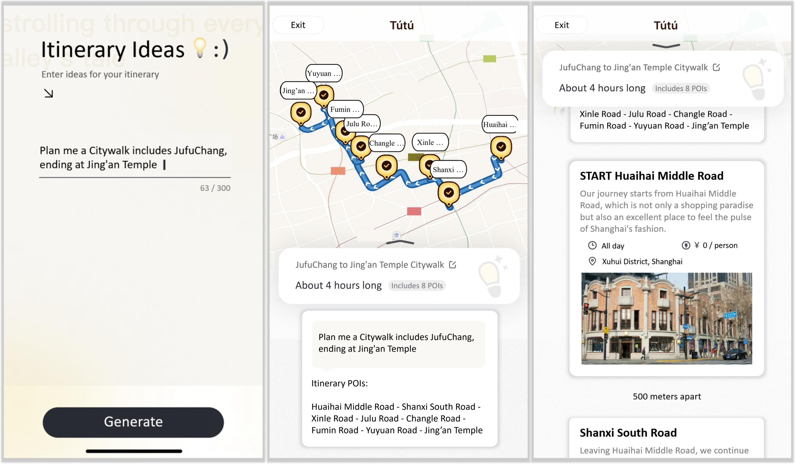
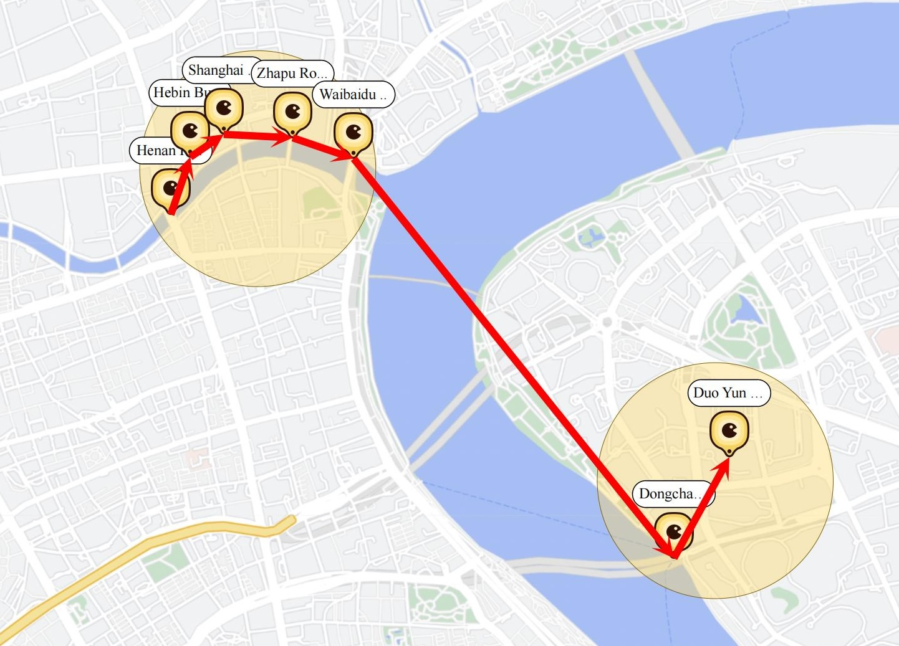
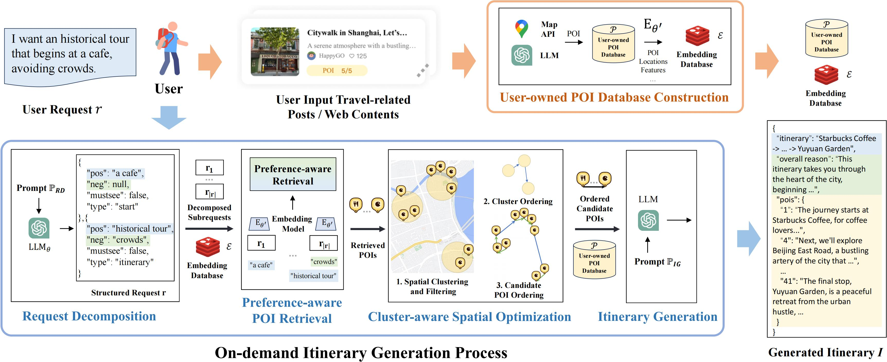

#  ItiNera

[[Paper]](https://aclanthology.org/2024.emnlp-industry.104.pdf) [[ArXiv]](https://arxiv.org/abs/2402.07204) [[Poster]](https://raw.githubusercontent.com/YihongT/ITINERA/refs/heads/main/imgs/Poster.png) [[Video]](https://aclanthology.org/attachments/2024.emnlp-industry.104.video.mp4) [[公众号报道]](https://mp.weixin.qq.com/s/44mtENyqrHiNEEcWS61COg)

Code for "ITINERA: Integrating Spatial Optimization with Large Language Models for Open-domain Urban Itinerary Planning" 

Published in the **EMNLP 2024 Industry Track** Proceedings

Received [**Best Paper Award**](https://raw.githubusercontent.com/YihongT/ITINERA/refs/heads/main/imgs/urbcomp.jpg) at **KDD Urban Computing Workshop (UrbComp) 2024**

If you find our work valuable or interesting, please consider **starring** ⭐️ our repository. Thank you!

## 📰 News

* [2024/11/8] We release the example dataset and inference code!


## ✨ Highlights

**TL;DR:** We present ItiNera, a system that integrates spatial optimization with large language models to generate customized and efficient itineraries for the Open-domain Urban Itinerary Planning (OUIP) problem.

* Addresses personalized itinerary planning by decomposing user requests and optimizing routes using spatial clusters.
* Generates urban travel plans by selecting and organizing points of interest (POIs) based on user needs in natural language.
* Outperforms traditional methods in delivering custom and spatially efficient itineraries, validated by experiments on real-world data.


<p align="center">
 
</p>


## 📌 Abstract

Citywalk, a recently popular form of urban travel, requires genuine personalization and understanding of fine-grained requests compared to traditional itinerary planning. In this paper, we introduce the novel task of Open-domain Urban Itinerary Planning (OUIP), which generates personalized urban itineraries from user requests in natural language. We then present ITINERA, an OUIP system that integrates spatial optimization with large language models to provide customized urban itineraries based on user needs. This involves decomposing user requests, selecting candidate points of interest (POIs), ordering the POIs based on cluster-aware spatial optimization, and generating the itinerary. Experiments on real-world datasets and the performance of the deployed system demonstrate our system's capacity to deliver personalized and spatially coherent itineraries compared to current solutions.

<p align="center">
 
</p>


## 🔍 Method




## 🛠️ Usage

Below are the instructions for running the open-source version of ItiNera. If you encounter any issues during the process, please open an issue in the repository for assistance.

<details>
<summary>Repository Structure</summary>

The repository is organized as follows:

```
│  .gitignore
│  LICENSE
│  main.py
│  README.md
│  requirements.txt
│
├─ imgs
└─ model
    │  itinera.py
    │  itinera_en.py
    │  search.py
    │  spatial.py
    │
    ├─ data
    │
    ├─ output
    │
    └─ utils
            all_en_prompts.py
            all_prompts.py
            funcs.py
            proxy_call.py
```
</details>

<details>
<summary>Environment Setup</summary>
This project is designed to run with Python 3.9.20. Install the dependencies with:


```bash
pip install -r requirements.txt
```


To run ItiNera, you need to set up your API key as an environment variable. Follow these instructions to export your API key:
```bash
export OPENAI_API_KEY="your_api_key_here"
```
</details>

<details>
<summary>Running Inference</summary>

To run the inference, use the following commands based on the language version:

For the Chinese version:
```bash
python main.py --type='zh'
```

For the English version:
```bash
python main.py --type='en'
```

</details>

<details>
<summary>Example Data</summary>

Sample datasets for both the Chinese and English versions are located in the following path:
```
└─ model
    ├─ data
    │      shanghai_en.csv
    │      shanghai_en.npy
    │      shanghai_zh.csv
    │      shanghai_zh.npy
```

- **.csv files**: Represent the Points of Interest (POI) dataset, where longitude and latitude are in the GCJ-02 coordinate system.
- **.npy files**: Contain embeddings generated from the 'context' column of the POI dataset.

The above data are only used for open-source and demonstration purposes, feel free to change to your own data in actual deployments.

</details>


<details>
<summary>Output and Visualization</summary>
Inference results are stored in `.json` files, while visualizations are provided in `.html` format. The output files are located in:

```
└─ model
    ├─ output
    │      2024_11_08_15_33_en.html                     
    │      2024_11_08_15_33_en_fulltsp.html             
    │      2024_11_08_15_33_en_response_clusters.html   
    │      2024_11_08_15_36_zh.html
    │      2024_11_08_15_36_zh_fulltsp.html
    │      2024_11_08_15_36_zh_response_clusters.html
    │      result_en.json                               
    │      result_zh.json
```

- **`<date_time>_en.html`**: Visualization file for the generated itinerary in English.
- **`<date_time>_en_fulltsp.html`**: Visualization file showing the ordered candidate Points of Interest (POIs) for the English itinerary.
- **`<date_time>_en_response_clusters.html`**: Visualization of POI clusters for the English itinerary.
- **`<date_time>_zh.html`, `<date_time>_zh_fulltsp.html`, `<date_time>_zh_response_clusters.html`**: Similar visualization files as above but in Chinese.
- **`result_en.json`**: Inference results in JSON format for the English itinerary.
- **`result_zh.json`**: Inference results in JSON format for the Chinese itinerary.

A visualization script is provided, integrating with Folium to display interactive maps.

</details>


## 📃 License

This project is released under the [license](LICENSE). For commercial use, please contact the authors directly via email.


## 🧰 Resources

Here are some helpful resources for the development process.

- [Scrapers](https://github.com/wzk1015/Scraper)
- [Amap Docs](https://lbs.amap.com/api/webservice/summary)

## 🖊️ Citation

If you find this work helpful for your research, please consider giving this repo a star ⭐ and citing our paper:

```bibtex
@inproceedings{tang2024itinera,
  title={ItiNera: Integrating Spatial Optimization with Large Language Models for Open-domain Urban Itinerary Planning},
  author={Tang, Yihong and Wang, Zhaokai and Qu, Ao and Yan, Yihao and Wu, Zhaofeng and Zhuang, Dingyi and Kai, Jushi and Hou, Kebing and Guo, Xiaotong and Zhao, Jinhua and others},
  booktitle={Proceedings of the 2024 Conference on Empirical Methods in Natural Language Processing: Industry Track},
  pages={1413--1432},
  year={2024}
}
```


## 💰 Donate

You are welcome to donate to ItiNera with [Buy Me a Coffee](https://www.buymeacoffee.com/yihongtangf) or WeChat:

<p align="center">
 
  &nbsp;&nbsp;&nbsp;&nbsp;&nbsp; &nbsp;&nbsp;&nbsp;&nbsp;&nbsp;
 
</p>
